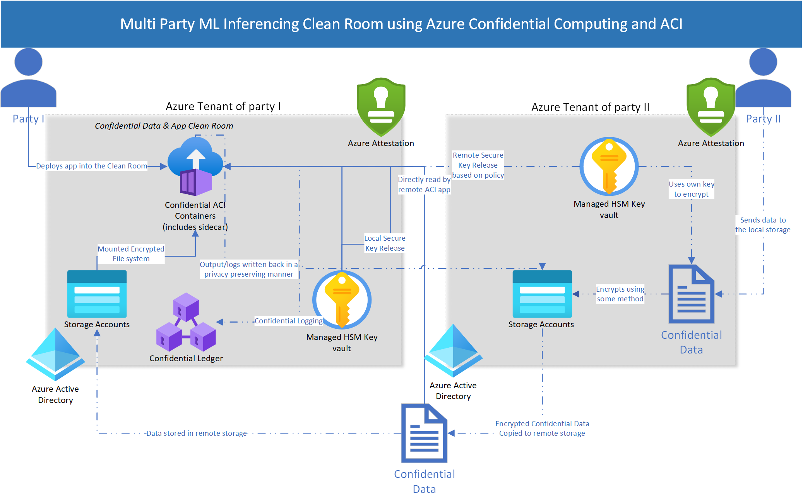

# NLP Inferencing on Confidential Azure Container Instance for Multi party scenarios

Thanks to the advancements in the area of natural language processing using machine learning techniques & highly successful new-age LLMs from OpenAI, Google & Microsoft - NLP based modeling & inferencing are one of the top areas of customer interest. These are being widely used in almost all Microsoft products & there is also a huge demand from our customers to utilize these techniques in their business apps. Similarly, there is a demand for privacy preserving infrastructure to run such apps. 

In this blog I am going to show how to run basic NLP text summarization using T5 & BART in a python `streamlit.io` based app & run it as a container on Confidential ACI container group. Before we go there, here are some details about Azure Confidential Computing for the uninitiated. Azure already encrypts data at rest and in transit, and confidential computing helps protect data in use, including the cryptographic keys.  Azure confidential computing helps customers prevent unauthorized access to data in use, including from the cloud operator, by processing data in a hardware-based and attested Trusted Execution Environment (TEE). 

Typically in an AI/ML scenario you are trying to protect the following from all other parties involved including the cloud provider.

* `Model IP`  
* `Training Data`  
* `Model weights`  
* `Inferencing data`  
* `Inference outcome`  
* `Other miscellaneous items`  

In this article we will create a python `streamlit.io` app and deploy it to Confidential ACI. The use case is loosely based on a 2 party multi party computing scenario where *party II* provides text data in encrypted format because they cannot allow *party I* to take a look at the text. However, their contract with *party I* allows *party I* to summarize the encrypted text and consume the summary. This entire process runs in the Azure tenant that belongs to *party I* but due to Confidential ACI, *party I* is at no point able to take a look at the original text data from *party II*. That, in a nutshell, is multi party confidential computing. (needless to say there can be *N* parties building this exact solution)

## Pre-requisites

Before starting please create the following pre-requisites in your Azure portal or using CLI:

##### Create your app using this repo and push it to Azure Container Registry. 

*Here are the possible steps*

* First build the docker image in WSL2 on Windows or bash if using linux (docker must be installed)

    `docker build . -t <your docker image name>`

* Create an ACR registry  [https://learn.microsoft.com/en-us/azure/container-registry/container-registry-get-started-portal?tabs=azure-cli]

* Push your image to the registry you created  
`az login`  
`az acr login --name <your ACR name>`  
`sudo docker login <your ACR name>.azurecr.io`  
`sudo docker tag <your repo name>:latest <your ACR name>.azurecr.io/<your repo name>:latest`  
`sudo docker push <your ACR name>.azurecr.io/<your repo name>:latest`  

##### Create a Managed HSM instance  
[https://learn.microsoft.com/en-us/azure/key-vault/managed-hsm/quick-create-cli]

##### Create an Azure Storage Account & create a container inside it 

[https://learn.microsoft.com/en-us/azure/storage/common/storage-account-create?tabs=azure-portal]

##### Create a SAS token for the container you created in the previous step above. 

[https://learn.microsoft.com/en-us/azure/cognitive-services/translator/document-translation/how-to-guides/create-sas-tokens?tabs=Containers]  

##### Create a user-assigned managed identity Manage user-assigned managed identities 
[https://learn.microsoft.com/en-us/azure/active-directory/managed-identities-azure-resources/how-manage-user-assigned-managed-identities?pivots=identity-mi-methods-azp#create-a-user-assigned-managed-identity]  

* Give the following permissions to your AAD user and the newly created user assigned managed identity on the Azure Managed HSM 

`Managed HSM Crypto User`  
`Managed HSM Crypto Officer`

## Next Steps
For the rest of the steps, please refer to the blog [https://techcommunity.microsoft.com/t5/azure-confidential-computing/nlp-inferencing-on-confidential-azure-container-instance/ba-p/3827628] (Continue from the section titled `Demo Steps`) 

### Optional

If you instead want to run this without Confidential option (although it defeats the purpose of this repo), please run the following

`az container create --resource-group <RG name> --name <Container name> --image <Your ACR image> --registry-login-server <ACR URl> --registry-username <> --registry-password <> --dns-name-label <DNS name> --ports <> --cpu <> --memory <> --location <>   --azure-file-volume-account-name  <Storage where the text file is> --azure-file-volume-account-key <>  --azure-file-volume-share-name <File Share name> --azure-file-volume-mount-path /mnt/remote/share`