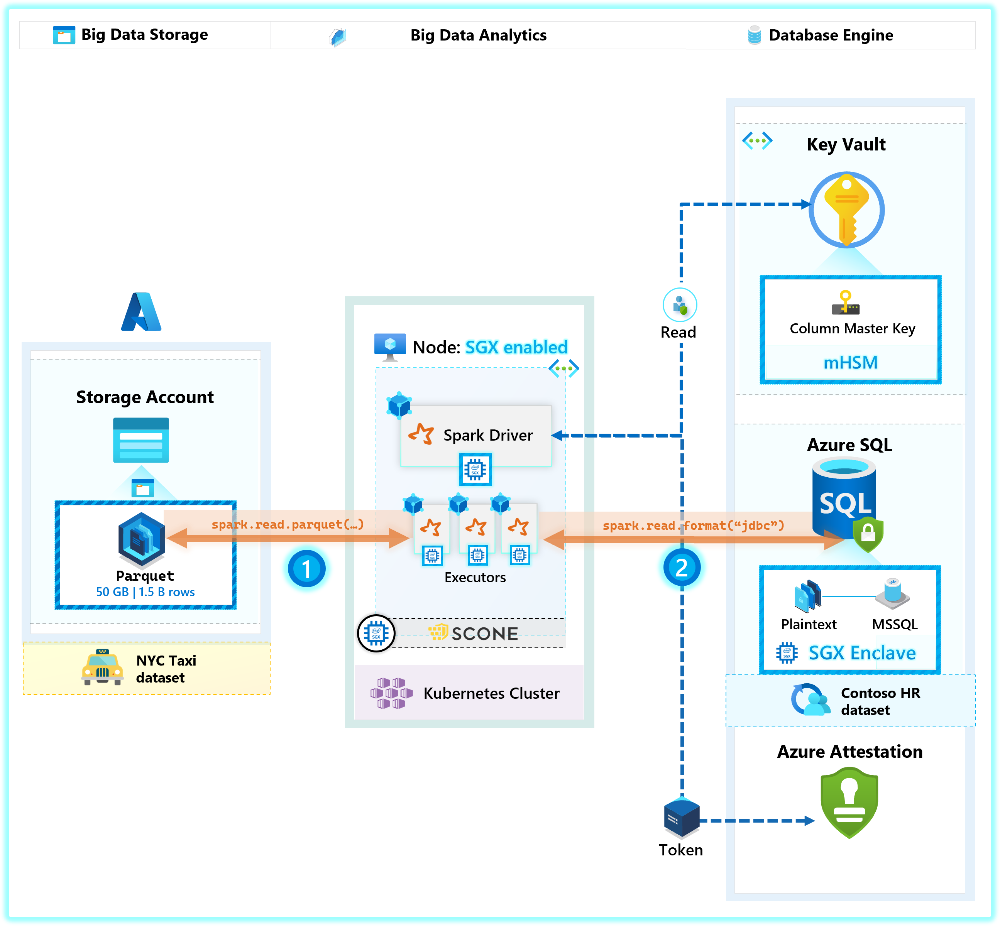
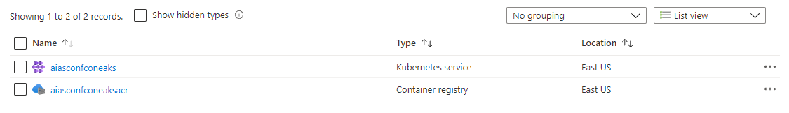
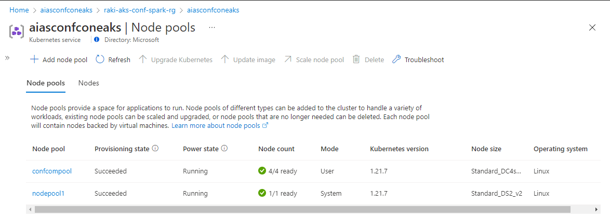
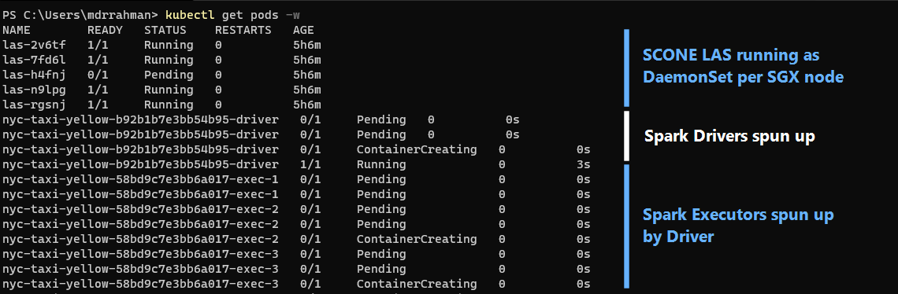
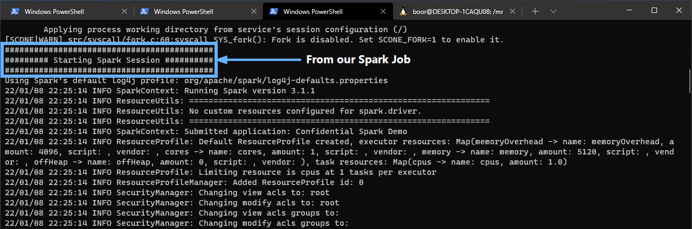
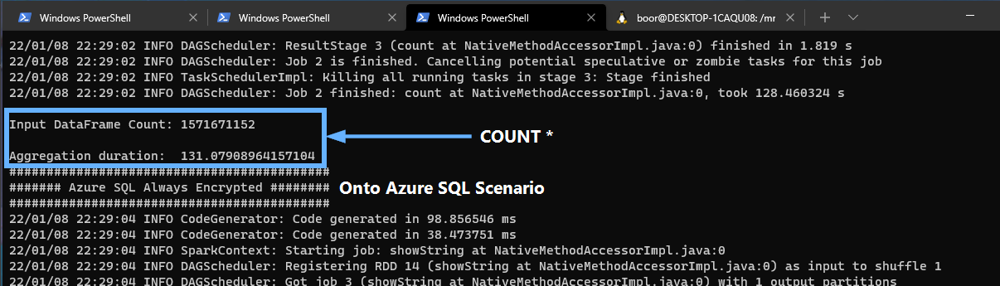
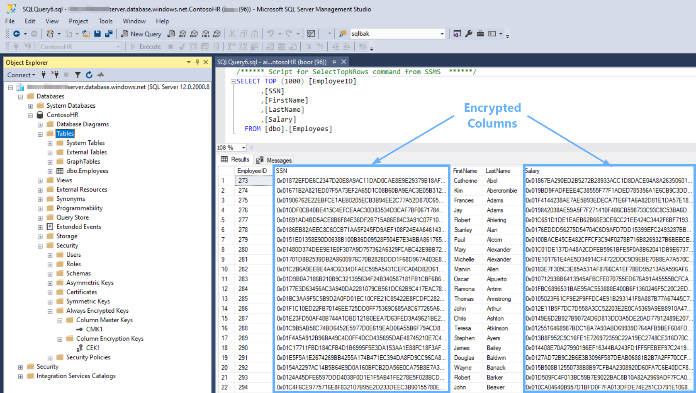
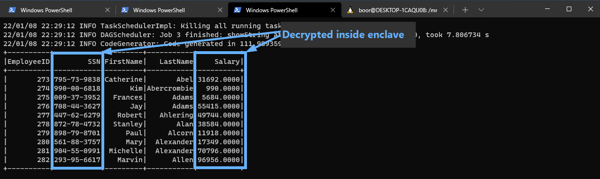
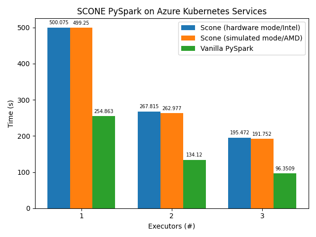

# Confidential Data Analytics with Apache Spark on Intel SGX Confidential Containers

## Overview

This repository demonstrates an architecture pattern for **Confidential Big Data Analytics** on Azure Intel SGX enabled Confidential machines on **Azure Kubernetes Service** for running containerized applications. <br>

Confidential data analytics in this context is meant to imply: **_"run analytics on PII data with peace of mind against data exfiltration"_** - this includes potential `root`-level access breach both internally (rogue Cluster Admin) or externally (system compromise).

Confidential data analytics helps meet your high security and confidentiality needs by removing the untrusted parties from computation like cloud operator, service/guest admins. This execution helps meet your data compliance needs using state-of-the-art hardware.

### Goal

Demonstrate how to run **end-to-end Confidential Data Analytics** on Azure (presumably on PII/trade sensistive data), leveraging [Azure SQL Always Encrypted with Secure Enclaves](https://docs.microsoft.com/en-us/sql/relational-databases/security/encryption/always-encrypted-enclaves?view=sql-server-ver15) as the database, and containerized **Apache Spark** on [Intel SGX-enabled Azure machines](https://docs.microsoft.com/en-us/azure/confidential-computing/confidential-computing-enclaves) for analytics workloads.

### Key points

- **Azure DC Series**: We run a containerized [Spark 3.1.1](https://spark.apache.org/releases/spark-release-3-1-1.html) application, on [AKS running DC4s_v3 nodes](https://docs.microsoft.com/en-us/azure/confidential-computing/confidential-computing-enclaves). These machines are backed by the latest generation of Intel XEON Scalable Processor with large Encrypted Page Cache (EPC) memory sizes. These Azure Virtual Machines include the [Intel SGX extensions](https://software.intel.com/content/www/us/en/develop/topics/software-guard-extensions.html) - the **_key component_** to enabling the core message of this demo.
- **SCONE**: To run Spark inside an Intel SGX enclave - we leverage [SCONE](https://docs.microsoft.com/en-us/azure/confidential-computing/confidential-containers#scone-scontain), who have essentially taken the [Open Source Spark code](https://sconedocs.github.io/sconeapps_spark/), and wrapped it with their enclave runtime so that Spark can run inside SGX enclaves (a task that requires deep knowledge of the SGX ecosystem - something SCONE is an expert at).
> 💡 Please note that SCONE (Scontain UG) is an Azure partner in confidential computing space who enables easy support to existing docker containers on Intel SGX Enclaves. You can also choose from other OSS and partners from [here](https://docs.microsoft.com/en-us/azure/confidential-computing/confidential-containers).

   - **Sconedocs**: Scone's official documentation for Azure integration and getting started: [link](https://sconedocs.github.io/aks/)

### Scenario

In this scenario, we leverage Spark with Scone on a [Confidential Capable AKS cluster](https://docs.microsoft.com/en-us/azure/confidential-computing/confidential-nodes-aks-get-started) to showcase a sample pattern for processing larger datasets in a distributed fashion, as well as showcasing confidential analytics on relational Database Engines storing confidential data.

> As a pre-requsite to this scenario, an Azure SQL Database with Always Encrypted with secure enclaves is required. Please follow the detailed steps outlined in this [`sql-server-samples` repository](https://github.com/microsoft/sql-server-samples/blob/master/samples/features/security/always-encrypted-with-secure-enclaves/azure-sql-database/README.md) to deploy the `ContosoHR` Database. We will not be using the App Service web app that is included in this scenario.

Our Spark application will process 2 sample datasets from 2 data sources:
1. [Azure Data Lake Storage - Parquet files](https://docs.microsoft.com/en-us/azure/storage/blobs/data-lake-storage-introduction): We use is the common [NYC Taxi](https://docs.microsoft.com/en-us/azure/open-datasets/dataset-taxi-yellow?tabs=pyspark) Dataset - where we demonstrate a simple Spark Job ([`COUNT *`](https://spark.apache.org/docs/latest/api/python/reference/api/pyspark.sql.DataFrame.count.html)) on 1.5 Billion Rows of Parquet files (50 GB) stored on Azure Data Lake Storage. The purpose here is to show the horizontal scalability (multiple-pods perform a single job) enabled through this architecture.
2. [Azure SQL DB - Always Encrypted with secure enclaves](https://docs.microsoft.com/en-us/sql/relational-databases/security/encryption/always-encrypted-enclaves?view=sql-server-ver15): We showcase how to access Always Encrypted data (Encrypted [`ContosoHR` Database](https://github.com/microsoft/sql-server-samples/blob/master/samples/features/security/always-encrypted-with-secure-enclaves/azure-sql-database/README.md#demos-steps-1) from this sample) as plaintext inside the Spark Container Enclave.

> Azure Confidential Enclave VM's [DCsv3 and DCdsv3](https://docs.microsoft.com/en-us/azure/virtual-machines/dcv3-series) is in public preview and offers large EPC memeory sizes to help run memory intensive applications like analytics.



The tasks are divided among the available executors (user configurable), which allows for horizontal scalability. The executors are written in Python and have their source code encrypted by the Scone filesystem protection features we've already discussed.

### A note about EPC Memory Size

The same protection guarantees as the previous scenarios apply here too. Kubernetes admins, or any privileged user, cannot inspect the in-memory contents or source code of driver or executors. EPC is specialized memory partition in an Azure Confidential Enclaves VM that Enclaves or Confidential containers use. These VM's also come with regular memory (un-encrypted) memory to run non-enclave apps. As part of this sample we did performance [benchmarking](#benchmark) and did not see any noticeable performance drops).

### Running with Remote Attestation

Remote attestation ensures that your workload has not been tampered with when deployed to a untrusted host, such as a VM instance or a Kubernetes node that runs on the cloud. In this process, attestation evidence provided by Intel SGX hardware is analyzed by an attestation provider. To perform remote attestation on a Scone application (such as Spark driver and executor pods), two services are required:

- **Local Attestation Service (LAS)**: runs on the untrusted host and gathers the attestation evidence provided by Intel SGX about the application being attested. This evidence is signed and forwarded to CAS; and
- **Configuration and Attestation Service (CAS)**: a central service that manages security policies (called **Scone _sessions_**), configuration and secrets. CAS compares the attestation evidence gathered by LAS against the application's security policies (defined by the application owner) to decide whether the enclave is trustworthy of not. If so, CAS allows the enclave to run and securely injects configuration and secrets into it. [Learn more about CAS and its features, such as secret generation and access control](https://sconedocs.github.io/CASOverview/).

> 💡 The decision of whether the attestation evidence is trustworthy or not can be delegated to a third-party attestation provider, such as Intel Attestation Service or [Microsoft Azure Attestation](https://docs.microsoft.com/en-us/azure/attestation/overview).

For this scenario, we use a [Public CAS](https://sconedocs.github.io/public-CAS/) provided by Scone for test purposes. In production scenarios you will control your own CAS - which also runs inside of enclaves and can be remotely attested.

#### Pre-requisite Setup

1. An Azure Subscription with `Owner` access (required to assign several Service Principal permissions).
2. [Docker Desktop](https://docs.docker.com/desktop/windows/wsl/#download)
   1. If running a Windows machine, you will require a Linux environment to run some of the deployment scripts - you can download an [Ubuntu 18.04 LTS](https://www.microsoft.com/en-us/p/ubuntu-1804-lts/9n9tngvndl3q) machine from the Microsoft Store, then [enable WSL integration](https://docs.docker.com/desktop/windows/wsl/#install) with Docker Desktop to access [`docker`](https://docs.docker.com/engine/reference/commandline/cli/) CLI commands _inside_ the WSL runtime.
3. Get access to the PySpark base image used in this demo from Scone's [Gitlab](gitlab.scontain.com) Container Registry: `registry.scontain.com:5050/clenimar/pyspark:5.6.0plus` - see [instructions here for Gitlab access](https://sconedocs.github.io/SCONE_Curated_Images/).
4. Deploy the `ContosoHR` demo database outlined [in this sample](https://github.com/microsoft/sql-server-samples/blob/master/samples/features/security/always-encrypted-with-secure-enclaves/azure-sql-database/README.md) and configure a Service Principal to have the following *Key Permissions* on the Key Vault storing the [CMK](https://docs.microsoft.com/en-us/azure/azure-sql/database/always-encrypted-azure-key-vault-configure?tabs=azure-powershell#master-key-configuration):
 - Key Management Operations: `Get`, `List`
 - Cryptographic Operations: `Unwrap Key`, `Wrap Key`, `Verify`, `Sign`

**Azure Infrastructure deployment - PowerShell:**
> 💡 If required - the script below can be run in a linux environment with minor syntax changes

The following script deploys an AKS Cluster with Confidential Nodepools:
```powershell
# 1. Configure kubectl access to a Confidential AKS Cluster
az account set --subscription "your--subscription--name"
$rg = "your--rg--name"
$k8s = "your--aks--name"

# Create RG
az group create --name $rg --location EastUS

# Create AKS cluster with System Node Pool
az aks create -g $rg --name $k8s --node-count 1 --ssh-key-value 'ssh-rsa AAA...' --enable-addon confcom

# Create Confidential Node Pool - 4 Confidential Nodes
az aks nodepool add --cluster-name $k8s --name confcompool1 -g $rg --node-vm-size Standard_DC4s_v2 --node-count 4

# Grab kubeconfig from AKS
az aks get-credentials -g $rg --name $k8s

# Prep kubectl
kubectl config get-contexts
kubectl config use-context $k8s
kubectl get nodes

# Should see something like this
# NAME                                   STATUS   ROLES   AGE     VERSION
# aks-confcompool1-42230234-vmss000000   Ready    agent   49s     v1.20.7
# ...

# 2. Deploy Scone LAS - Local Attestation Service - to your Kubernetes cluster
# https://sconedocs.github.io/LASIntro/
kubectl apply -f kubernetes/scone-las.yaml

# Submit RBAC policies to your Kubernetes cluster
kubectl apply -f kubernetes/rbac.yaml

# 3. Get access to PySpark base image from Scone's Container Registry, build and push to your Container Registry that AKS has access to - e.g. ACR

# Login to Scone's container registry (after receiving access to Gitlab)
docker login registry.scontain.com:5050 -u your--scone--gitlab--username -p your--scone--gitlab--password

# Pull PySpark Container image to Docker
docker pull registry.scontain.com:5050/clenimar/pyspark:5.6.0plus

# Create ACR and login
$acr = $k8s + "acr"
az acr create -g $rg --name $acr --sku Basic
az acr login --name $acr

# Image pull secret for Kubernetes
# AAD Service Principal creating secret - can use new/existing Service Principals
$SERVICE_PRINCIPAL_ID="your--sp--clientid"
$SERVICE_PRINCIPAL_SECRET="your--sp--clientpassword"

# Assign Service Principal to ACR with image pull permissions
$ACR_REGISTRY_ID=$(az acr show -g $rg --name $acr --query id --output tsv)
az role assignment create --assignee $SERVICE_PRINCIPAL_ID --scope $ACR_REGISTRY_ID --role acrpull

# Create Kubernetes Image secret in default namespace
kubectl create secret docker-registry acrsecret `
					    --namespace default `
					    --docker-server="$acr.azurecr.io" `
					    --docker-username=$SERVICE_PRINCIPAL_ID `
					    --docker-password=$SERVICE_PRINCIPAL_SECRET

```
Once the above script is run - you will see these 2 resources:


And a Confidential Node pool created:



**Execute steps - bash**
> ❗ The script below must run in a `bash` shell due to several dependencies on linux specific commands

The following script deploys the Spark job. Prior to running the bash commands - please replace the following placeholders `<...>` in the JDBC string for the `ContosoHR` database in [`policies\pyspark.hw.yaml.template`](policies\pyspark.hw.yaml.template)
```text
jdbc:sqlserver://<your-azure-sql-server>.database.windows.net:1433;database=ContosoHR;user=<your-sql-auth-username>@<your-azure-sql-server>;password=<your-sql-auth-password>;columnEncryptionSetting=enabled;enclaveAttestationUrl=https://<your-attestation-url>.eus.attest.azure.net/attest/SgxEnclave;enclaveAttestationProtocol=AAS;keyVaultProviderClientId=<your-sp-clientid>;keyVaultProviderClientKey=<your--sp--clientkey>;
```

> In the script below - several places have instructions for [SCONE Simulation mode](https://sconedocs.github.io/firstcontainer/). However, since we have a confidential NodePool in AKS - we will not be needing this.

```bash
# Change to directory with this repo
cd "/mnt/c/Users/your--username/My Documents/GitHub/sgx-pyspark-sql-demo"

# If in WSL - run dos2unix
./convert_dos2unix.sh

##################################################################################################
# Env variables
##################################################################################################
export K8s=your--aks--name
export ACR=$K8s"acr"
export SPARK_IMAGE=$ACR.azurecr.io/pyspark-scone:5.6.0
# Configure remote attestation and submit your SCONE policies.
# Specify your SCONE CAS[1] address and MrEnclave.
# In this example, we use a public CAS instance[2] for testing purposes.
# [1] https://sconedocs.github.io/CASOverview/
# [2] https://sconedocs.github.io/public-CAS/
export SCONE_CAS_ADDR="5-6-0.scone-cas.cf"
export SCONE_CAS_MRENCLAVE="0902eec722b3de0d11b56aab3671cc8540e62bd2333427780c8a9cd855e4f298"
# If running with Microsoft Azure Attestation policy, export the MAA provider URL.
# NOTE: MAA is not supported in simulated mode (i.e., on hardware without SGX support).
export MAA_PROVIDER="https://sharedeus.eus.attest.azure.net"
# Retrieve the Kubernetes master IP address to use in the spark-submit command.
MASTER_ADDRESS=$(kubectl config view --minify -o jsonpath='{.clusters[0].cluster.server}')
# Path where kubeconfig is stored in your environment.
export KUBECONFIG_DIR=/mnt/c/Users/your--username/.kube
##################################################################################################

# Login to Azure
az login
az account set --subscription "your--subscription--name"
az acr login --name $ACR

##################################################################################################
# SCONE Image build and configuration
##################################################################################################

# Build the confidential Spark image - this also creates the "build" directory every run
./build-spark-image.sh

# Source the needed environment variables generated by the build script.
# The directory "build" is created by the build script and stores build resources
# for the encrypted Spark images (such as properties, SCONE policies and metadata).
source build/env.sh

# Push image to ACR so it is accessible from AKS
docker push $SPARK_IMAGE

# Attest SCONE CAS
docker run --rm -t \
  -e SCONE_CLI_CONFIG=/cas/config.json \
  -v "$PWD"/build/cas:/cas \
  --entrypoint bash \
  $SPARK_IMAGE -c "scone cas attest $SCONE_CAS_ADDR $SCONE_CAS_MRENCLAVE -GCS --only_for_testing-debug --only_for_testing-ignore-signer"
# You should see:
# CAS 5-6-0.scone-cas.cf at https://5-6-0.scone-cas.cf:8081/ is trustworthy

# Create your CAS namespace from the template and submit it.
envsubst '$CAS_NAMESPACE' < policies/namespace.yaml.template > build/policies/namespace.yaml

docker run --rm -t \
  -e SCONE_CLI_CONFIG=/cas/config.json \
  -v "$PWD"/build/cas:/cas \
  -v "$PWD"/build/policies:/policies \
  --entrypoint bash \
  $SPARK_IMAGE -c "scone session create /policies/namespace.yaml"
# You should see a guid such as - b17f3edcdccf...

# Create your SCONE policy for Spark drivers and executors from the template and submit it.
# NOTE: If running in simulated mode (i.e., on hardware without SGX support), use "policies/pyspark.sim.yaml.template" instead.
# This is not the case for us since we have an AKS nodepool - so use the following as is:
envsubst '$SCONE_CAS_ADDR $CAS_NAMESPACE $PYSPARK_SESSION_NAME $DRIVER_MAIN_FSPF_KEY $DRIVER_MAIN_FSPF_TAG $DRIVER_VOLUME_FSPF_KEY $DRIVER_VOLUME_FSPF_TAG $DRIVER_JAVA_MRENCLAVE $DRIVER_PYTHON_MRENCLAVE $EXECUTOR_JAVA_MRENCLAVE' < policies/pyspark.hw.yaml.template > build/policies/pyspark.yaml

docker run --rm -t \
  -e SCONE_CLI_CONFIG=/cas/config.json \
  -v "$PWD"/build/cas:/cas \
  -v "$PWD"/build/policies:/policies \
  --entrypoint bash \
  $SPARK_IMAGE -c "scone session create /policies/pyspark.yaml"
# # You should see a guid such as - 7ac45aff0da0b...

# Set from generated build variables
export SCONE_CONFIG_ID="$CAS_NAMESPACE/$PYSPARK_SESSION_NAME/nyc-taxi-yellow"

# Generate your Spark properties file from the template.
# NOTE: If running in simulated mode (i.e., on hardware without SGX support), use "properties.sim.template" instead.
envsubst < properties.hw.template > build/properties

# Since we are using images held in ACR, add
# `spark.kubernetes.container.image.pullSecrets $SECRET_NAME` to properties file.
echo 'spark.kubernetes.container.image.pullSecrets acrsecret' >> build/properties

# Copy the pod template to provide SGX to Spark driver and executors.
# NOTE: If running in simulated mode (i.e., on hardware without SGX support), use "kubernetes/sim-sgx-pod-template.yaml" instead.
cp kubernetes/hw-sgx-pod-template.yaml build/kubernetes

# Confirm values in the Spark properties file. You can customize parameters such as executor count etc before we spark-submit
cat build/properties

##################################################################################################
# Submit the Spark job with spark-submit
################################################################################################## 
# We use a vanilla Spark image (https://github.com/godatadriven-dockerhub/pyspark) to run spark-submit for simplicity.
# This image runs on our local Docker Desktop to submit the Spark job - without SGX support
# We mount the kubeconfig from our local machine into the Spark client container to connect to the K8s master node.

# The submission step takes place on the local machine - untrusted
# The analytics job to be executed on the remote cluster - attested, then trusted

# Submit Spark job
docker run -it --rm \
  -v $KUBECONFIG_DIR:/root/.kube \
  -v "$PWD"/build:/build godatadriven/pyspark:3.1 \
  --master k8s://$MASTER_ADDRESS \
  --deploy-mode cluster \
  --name nyc-taxi-yellow \
  --properties-file /build/properties local:///fspf/encrypted-files/nyc-taxi-yellow.py

##################################################################################################
# The driver pod will spawn the executor pod(s), and clean up after they're finished.
# Once the job is finished, the driver pod will be kept in Completed state.

# Spark logs will be displayed in the driver pod - follow by substituting the name of your driver pod that gets generated
##################################################################################################
kubectl get pods -w

kubectl logs nyc-taxi-yellow-...-driver --follow # Run this outside the container to see logs in real-time
```

After running `spark-submit` - we see the following Pods:


And we follow the Driver Pod's logs to see the Spark Session get spun up:


Counting 1.5 billion rows across 50 GB of partition Parquet files takes about ~131 seconds:\


Finally - we have our Always Encrypted `ContosoHR` database - accessing from SSMS here, where the columns are encrypted as expected:


And we see the decrypted columns inside the enclave in Spark:


### Benchmark

To assess performance of Spark with Scone, we compare Scone against a vanilla PySpark (e,g, a regular [Bitnami image](https://hub.docker.com/r/bitnami/spark/tags?page=1&ordering=last_updated) with no SGX support) image for the same aggregation on a large dataset stored in Azure Blob Storage. For our benchmark, we use the [NYC Taxi (Yellow)](https://docs.microsoft.com/en-us/azure/open-datasets/dataset-taxi-yellow) dataset, which has approximately 1.5 billion rows and 50 GB. The reader is encouraged to try this on even larger datasets - similar results should follow.

**Workload:**

- Spark job performs a `df.count()` on the dataset, which returns the total number of rows. In Scone scenarios, the workload (drivers/executors) have their Python code encrypted.

Scenarios:

| Scenario | Description |
| :-: | - |
| **Vanilla (Intel/no SGX)** | Baseline. The driver and the executors are in plain text and run on Intel CPUs without SGX support using vanilla PySpark images |
| **Scone (AMD/simulated mode)** | The driver and the executors are encrypted and run on AMD CPUs. Scone simulates an SGX enclave by creating encrypted memory regions |
| **Scone (Intel/hardware mode)** | The driver and the executors are encrypted and run on Intel CPUs with SGX support, benefitting from all hardware-backed security guarantees provided by Intel SGX and Scone |


Clusters:

| Scenario | Cluster | Node size | Cores; RAM | SGX EPC memory | Region |
| :-: | :-: | :-: | :-: | :-: | :-: |
| **Vanilla (Intel/no SGX)** | Intel | [Standard_D4s_v4](https://docs.microsoft.com/en-us/azure/virtual-machines/dv4-dsv4-series) | 4 vCPUs; 16 GB | - | us-east |
 **Scone (AMD/simulated mode)** | AMD | [Standard_D4a_v4](https://docs.microsoft.com/en-us/azure/virtual-machines/dav4-dasv4-series#dav4-series) | 4 vCPUs; 16 GB | - | us-east |
**Scone (Intel/hardware mode)** | Intel | [Standard_DC4ds_v3](https://docs.microsoft.com/en-us/azure/virtual-machines/dcv3-series) | 4 CPUs; 32 GB (this includes SGX EPC memory) | 16 GB | us-east2 |


- All scenarios run on AKS clusters.
- The dataset is located in `us-east` region.
- All Pods (driver or executor) have the same CPU and memory requests/limits in Kubernetes.
- We run one executor per cluster node.
- The results below are the mean of each configuration. We use a repetition factor of 3.

Results:



The results show that Scone PySpark is able to run PySpark applications in a distributed fashion, being able to horizontally scale the workload across multiple Spark executors for a simple aggregation over a large dataset. Even though the aggregation itself is simple (`df.count()`), it shows that having a dataset much larger (50 GB) than the container memory limits (**10 GB**), enclave sizes (**1 GB** for Python processes and **4 GB** for Java processes) and SGX EPC memory (**16 GB** for [DC4ds_v3](https://docs.microsoft.com/en-us/azure/virtual-machines/dcv3-series)) is not a practical bottleneck. Furthermore, Scone scenarios have their driver/executor code encrypted.

It's also important to notice that the overhead in execution time observed for Scone scenarios (hardware mode or simulated mode) compared to Vanilla PySpark image corresponds to the **enclave startup process**. This process takes a fixed amount of time given an enclave size. Therefore, for applications that are more complex and take longer to complete, this overhead should correspond to a small fraction of the overall execution time.

Scone also supports the fine-tuning of its runtime performance through a configuration file, where one can configure the number of queues and threads to better suit the workload needs. For example, workloads that execute more system calls (e.g., I/O-intensive) tend to benefit from having more application threads (called _ethreads_), or to have them pinned to specific CPU cores to avoid core switching. [Learn more about Scone runtime configuration](https://sconedocs.github.io/SCONE_ENV/).
