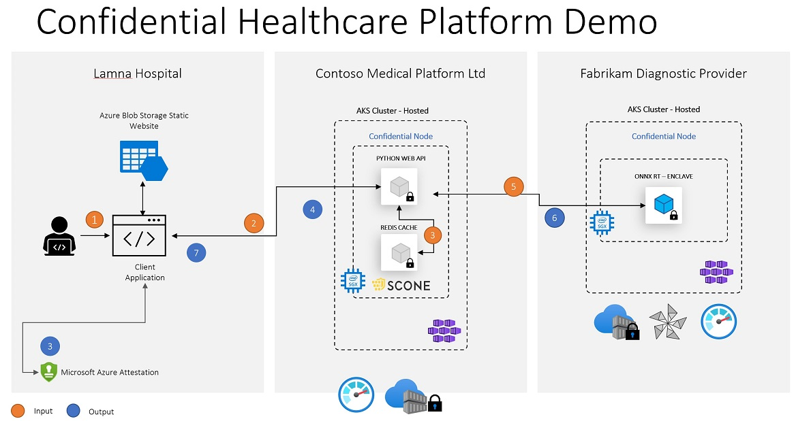

# Confidential HealthCare Demo With Scone, Confidential Inferencing ONNX Runtime & Azure Attestation (MAA)

## Background

1. 3 parties - Lamna Hospital, Contoso software provider and Fabrikam diagnostic provider 

2. Lamna hospital is little skeptical leveraging a provider hosted application that processes sensitive data. Contoso wants to leverage the advanced analytics through ML based-applications provided by Fabrikam but is concerned about Lamnas sensitive data and its trust with 3rd party.

## Approach

Contoso would host the solution for Lamna leveraging SGX enclave-based trusted execution environment. Protect its internal IP and data-in use through confidential computing.  Contoso chooses Scone as software to take an existing Python Flask based Web API and Redis Cache Service and run them confidentially.

Contoso leverages Fabrikam SaaS providers ML inferencing service to bring value added services to Lamna while keeping the code and data integrity.

Fabrikam chooses to also host its services on confidential computing providing the same confidentiality assurances with an open and auditable application. Fabrikam chooses Confidential Inferencing ONNX Runtime.



## Live Demo

> [!VIDEO https://www.youtube.com/watch?v=PiYCQmOh0EI&feature=youtu.be]

## Implementation Dependencies

### Provider Dependencies

1. Azure Partner (ISV) - [Scontain (SCONE)](https://sconedocs.github.io/) 
2. Open Source Solution (OSS) - [Confidential Inferencing ONNX Runtime](https://aka.ms/confidentialinference)
3. Azure 1st Party Service - [Azure Attestation](https://aka.ms/azureattestation)
4. Azure 1st Party Service  - [Azure Kubernetes Service with confidential computing nodes](https://aka.ms/acconakspreview)

### Programming Language

Python, C++, Shell Script

## A simple flask example executed inside of an SGX enclave

> !NOTE:
> This sample leverages the Scone Flask WEB API Samples referenced [here](https://sconedocs.github.io/flask_demo/). Please download the latest implementation from the Scone Flask Web API Samples Repo for the latest code. Scone ISV licensing may need to procured to run.

## Setup

```bash
git clone https://github.com/...
cd flask_example
```

Prepare inference model:
```sh
cd model
./run.sh
```
This creates `unet.onnx` which is an ONNX model file.

The model file is used as part of an ONNX Runtime Confidential Inference Server deployment.
See https://... for instructions on how to do that. Once you are done, return here.
Make a note of the server address and API key you used during deployment.

## Run Service using docker-compose

```bash
export CONFONNX_URL=http://...
export CONFONNX_API_KEY=...
export CONFONNX_DIR=/path/to/confonnx/repo
export AZ_APP_ID=...
export AZ_APP_PWD=...
./create_image.sh
source myenv
docker-compose up
```

### Testing the service

Retrieve the API certificate from CAS:

```bash
source myenv
curl -k -X GET "https://${SCONE_CAS_ADDR-cas}:8081/v1/values/session=$FLASK_SESSION" | jq -r .values.api_ca_cert.value > cacert.pem
```

Since the API certificates are issued to the host name "api", we have to use it. You can rely on cURL's --resolve option to point to the actual address (you can also edit your /etc/hosts file).

```bash
export URL=https://api:4996
```

```bash
curl --cacert cacert.pem -X POST ${URL}/patient/patient_3 -d "fname=Jane&lname=Doe&address='123 Main Street'&city=Richmond&state=Washington&ssn=123-223-2345&email=nr@aaa.com&dob=01/01/2010&contactphone=123-234-3456&drugallergies='Sulpha, Penicillin, Tree Nut'&preexistingconditions='diabetes, hypertension, asthma'&dateadmitted=01/05/2010&insurancedetails='Primera Blue Cross'" --resolve api:4996:127.0.0.1
curl --cacert cacert.pem -X GET ${URL}/patient/patient_3 --resolve api:4996:127.0.0.1
curl --cacert cacert.pem -X GET ${URL}/score/patient_3 --resolve api:4996:127.0.0.1
curl --cacert cacert.pem -X POST ${URL}/delineate -F img=@model/brain-segmentation-pytorch/assets/TCGA_CS_4944.png
```

The output might look as follows:

```txt
$ curl --cacert cacert.pem -X POST https://localhost:4996/patient/patient_3 -d "fname=Jane&lname=Doe&address='123 Main Street'&city=Richmond&state=Washington&ssn=123-223-2345&email=nr@aaa.com&dob=01/01/2010&contactphone=123-234-3456&drugallergies='Sulpha, Penicillin, Tree Nut'&preexistingconditions='diabetes, hypertension, asthma'&dateadmitted=01/05/2010&insurancedetails='Primera Blue Cross'" --resolve api:4996:127.0.0.1
{"address":"'123 Main Street'","city":"Richmond","contactphone":"123-234-3456","dateadmitted":"01/05/2010","dob":"01/01/2010","drugallergies":"'Sulpha, Penicillin, Tree Nut'","email":"nr@aaa.com","fname":"Jane","id":"patient_3","insurancedetails":"'Primera Blue Cross'","lname":"Doe","preexistingconditions":"'diabetes, hypertension, asthma'","score":0.1168424489618366,"ssn":"123-223-2345","state":"Washington"}
$ curl --cacert cacert.pem -X GET localhost:4996/patient/patient_3 --resolve api:4996:127.0.0.1
{"address":"'123 Main Street'","city":"Richmond","contactphone":"123-234-3456","dateadmitted":"01/05/2010","dob":"01/01/2010","drugallergies":"'Sulpha, Penicillin, Tree Nut'","email":"nr@aaa.com","fname":"Jane","id":"patient_3","insurancedetails":"'Primera Blue Cross'","lname":"Doe","preexistingconditions":"'diabetes, hypertension, asthma'","score":0.1168424489618366,"ssn":"123-223-2345","state":"Washington"}
$ curl --cacert cacert.pem -X GET localhost:4996/score/patient_3 --resolve api:4996:127.0.0.1
{"id":"patient_3","score":0.2781606437899131}
```

## Execution on a Kubernetes Cluster

### Install SCONE services

Get access to `SconeApps` (see <https://sconedocs.github.io/helm/>):

```bash
helm repo add sconeapps https://${GH_TOKEN}@raw.githubusercontent.com/scontain/sconeapps/master/
helm repo update
```

Give SconeApps access to the private docker images (see <https://sconedocs.github.io/helm/>)

```bash
export DOCKER_HUB_USERNAME=...
export DOCKER_HUB_ACCESS_TOKEN=...
export DOCKER_HUB_EMAIL=...

kubectl create secret docker-registry sconeapps --docker-server=index.docker.io/v1/ --docker-username=$DOCKER_HUB_USERNAME --docker-password=$DOCKER_HUB_ACCESS_TOKEN --docker-email=$DOCKER_HUB_EMAIL
```

Start LAS and CAS service:

```bash
helm install las sconeapps/las --set service.hostPort=true
helm install cas sconeapps/cas
```

Install the SGX device plugin for Kubernetes:

```bash
helm install sgxdevplugin sconeapps/sgxdevplugin
```

### Run the application

Start by creating a Docker image and setting its name. Remember to specify a repository to which you are allowed to push:

```bash
export IMAGE=myregistry.azurecr.io/flask_restapi_image
# Optional: export FLASK_HOSTNAME=<name>.<location>.cloudapp.azure.com
# Optional: export LETSENCRYPT_CERT_DIR=/path/to/certs
./create_image.sh
source myenv
docker push $IMAGE
```

Use the Helm chart in `deploy/helm` to deploy the application to a Kubernetes cluster.

```bash
helm install api-v1 deploy/helm \
   --set image=$IMAGE \
   --set scone.cas=$SCONE_CAS_ADDR \
   --set scone.flask_session=$FLASK_SESSION/flask_restapi \
   --set scone.redis_session=$REDIS_SESSION/redis \
   --set service.type=LoadBalancer
```

**NOTE**: Setting `service.type=LoadBalancer` will allow the application to get traffic from the internet (through a managed LoadBalancer).

### Test the application

After all resources are `Running`, you can test the API via Helm:

```bash
helm test api-v1
```

Helm will run a pod with a couple of pre-set queries to check if the API is working properly.

### Access the application

If the application is exposed to the world through a service of type LoadBalancer, you can retrieve its CA certificate from CAS:

```bash
source myenv
curl -k -X GET "https://${SCONE_CAS_ADDR-cas}:8081/v1/values/session=$FLASK_SESSION" | jq -r .values.api_ca_cert.value > cacert.pem
```

Retrieve the service public IP address:

```bash
export SERVICE_IP=$(kubectl get svc --namespace default api-v1-example --template "{{ range (index .status.loadBalancer.ingress 0) }}{{.}}{{ end }}")
```

Since the API certificates are issued to the host name "api", we have to use it. You can rely on cURL's --resolve option to point to the actual address (you can also edit your /etc/hosts file).

```bash
export URL=https://api
```

Now you can perform queries such as:

```bash
curl --cacert cacert.pem -X POST ${URL}/patient/patient_3 -d "fname=Jane&lname=Doe&address='123 Main Street'&city=Richmond&state=Washington&ssn=123-223-2345&email=nr@aaa.com&dob=01/01/2010&contactphone=123-234-3456&drugallergies='Sulpha, Penicillin, Tree Nut'&preexistingconditions='diabetes, hypertension, asthma'&dateadmitted=01/05/2010&insurancedetails='Primera Blue Cross'" --resolve api:443:${SERVICE_IP}
curl --cacert cacert.pem -X POST ${URL}/delineate -F img=@model/brain-segmentation-pytorch/assets/TCGA_CS_4944.png --resolve api:443:${SERVICE_IP}
```

### Deploy and access the web client

The folder `web_client/` contains a basic static website to access the deployed enclave service.
The static website can be deployed directly to Azure Blob Storage since it does not have a backend component.
Make sure to replace the server URL before deploying the website.

The following sample image can be used to try the delineation function which invokes the deployed confidential inference server: [Sample Image](https://github.com/mateuszbuda/brain-segmentation-pytorch/blob/master/assets/TCGA_CS_4944.png).

### Clean up

```bash
helm delete cas
helm delete las
helm delete sgxdevplugin
helm delete api-v1
kubectl delete pod api-v1-example-test-api
```