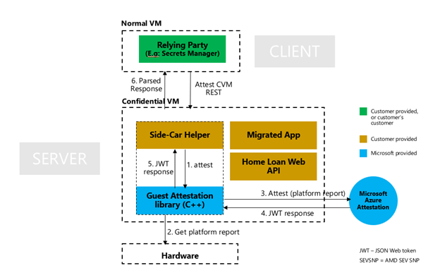
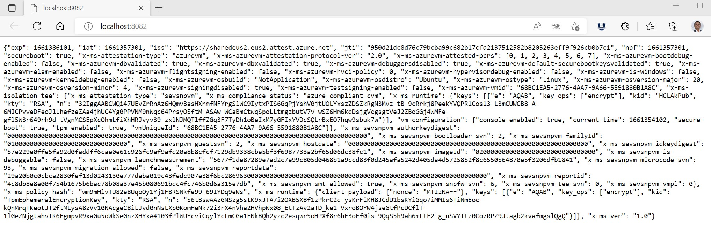

# Confidential VM (AMD SEV-SNP) Remote Attestation Web API Helper Application

This solution is to be deployed on a [Azure Confidential VM's DCav5/Ecav5](https://docs.microsoft.com/en-us/azure/confidential-computing/confidential-vm-overview) and will run a Python web Server that leverages a [CVM attestation client](https://github.com/Azure/confidential-computing-cvm-guest-attestation) to do the below:

* Builds Linux Attestation application client
* Runs this Linux app as subprocess within Python file
* Fetches raw SNP hardware report and sends that to MAA for verification
* Decodes the JWT from MAA and sends it back to web server

## Scenario

This solution helps a client (any application/service) connecting with server application running in a CVM to to verify the trustworthiness of a platform and integrity of the binaries running inside CVM. [Microsoft Azure Attestation (MAA)](https://docs.microsoft.com/en-us/azure/attestation/overview) is used to verify the Trusted Execution Environment (TEE) is genuine Confidential VM instance running with [AMD SEV-SNP](https://www.amd.com/system/files/TechDocs/SEV-SNP-strengthening-vm-isolation-with-integrity-protection-and-more.pdf) protection. Once successfully attested, client apps can share secrets or sensitive data with the server app running in a CVM and continue with operations.

## Solution details

A HTTP GET request will print the MAA token after going through the attestation flow running in a Confidential VM, Here is the basic architecture, the helper API is what this solution is providing



A screenshot of webAPI GET request after successful attestation flow



## Sample Response from Web API

You can view a sample output of this WEB API GET method [here](outputjsonsample.json)

## Deploy and run on CVM

* Run python application directly with "sudo python3 app.py" once after cloning the repository, make sure to run "prereqattestclient.sh" script
* Expose port 8081 from CVM to access from public IP

## Deploy and run on AKS with Confidential VM agent node pools

NOTE: You can perform this build container and push to registry from your local dev workstation. Make sure to have docker engine installed

* Build a container using the Dockerfile in this repo by navigating to this repo and running "docker build ."
* Tag and push the container to your container registry
* Use this reference deployment yaml file to mount the required volumes from TPM device. This is a must for fetching an attestation report
* At this time attestation client requires you to run this container on AKS as privileged=true

### Deploy AKS cluster with CVM node pools

[Follow the instructions on this page for AKS deployments](https://docs.microsoft.com/en-us/azure/aks/use-cvm).

Login in to the AKS cluster after successful deployment

### Deploy the container on CVM node

On the AKS cluster deploy the container using this command

```azurecli
kubectl apply -f "k8sdeploy.yaml"
```
[Refer this sample deployment yaml file for more details](/cvm-python-app-remoteattest/k8sdeploy.yaml).

## Further extension of sample

This WEB API can be embedded in the overall application flow that brings in the attest and then exchange secrets or perform data computation.