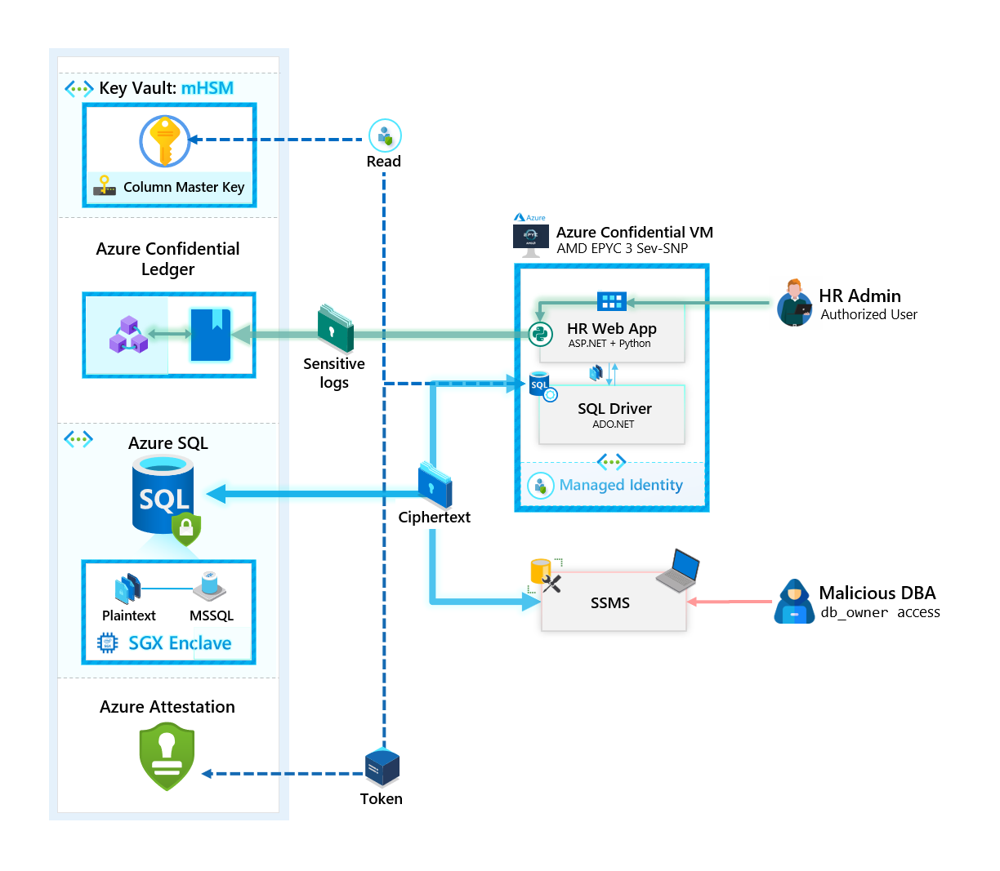
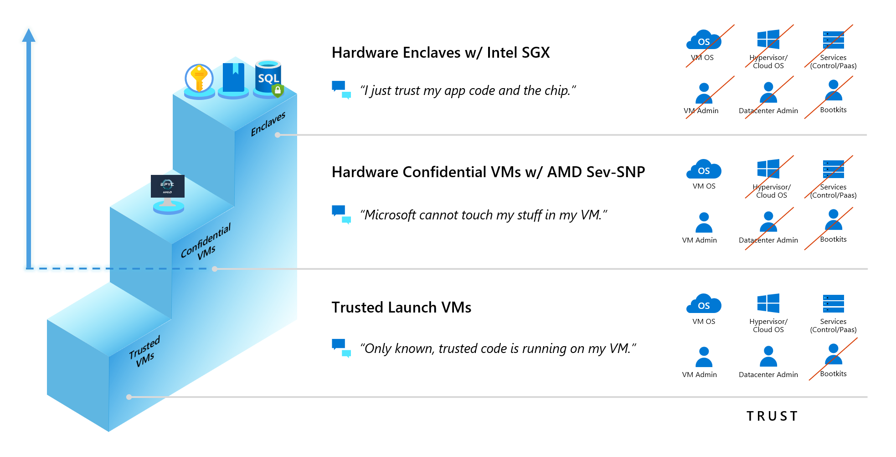
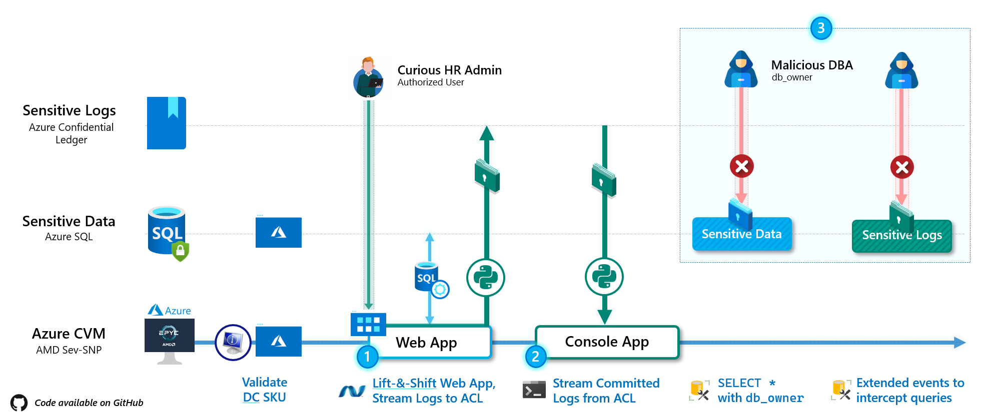
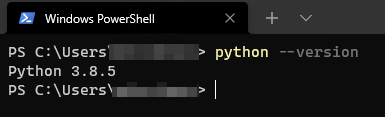
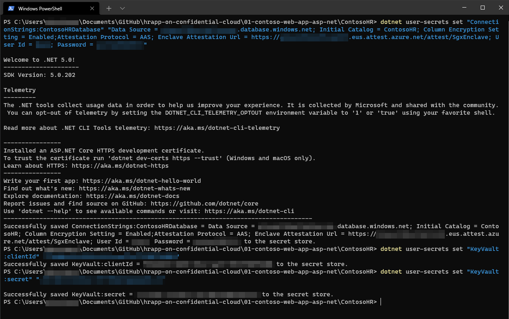
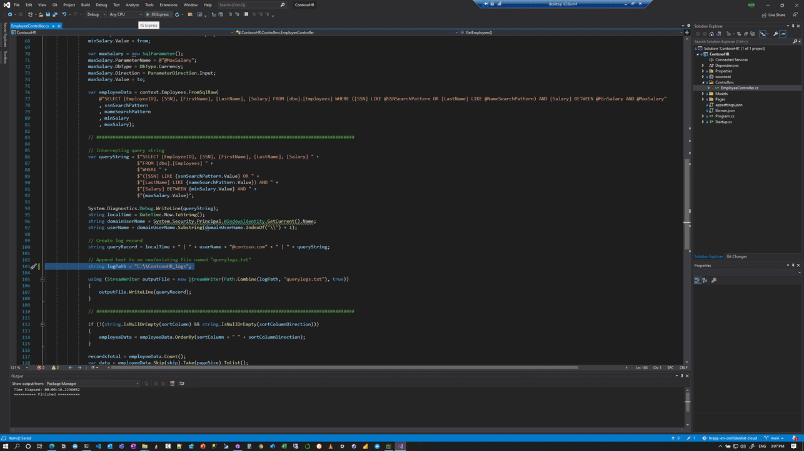
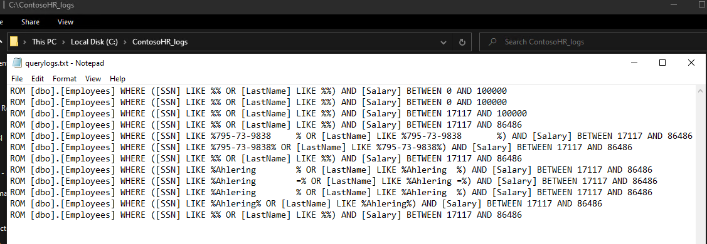
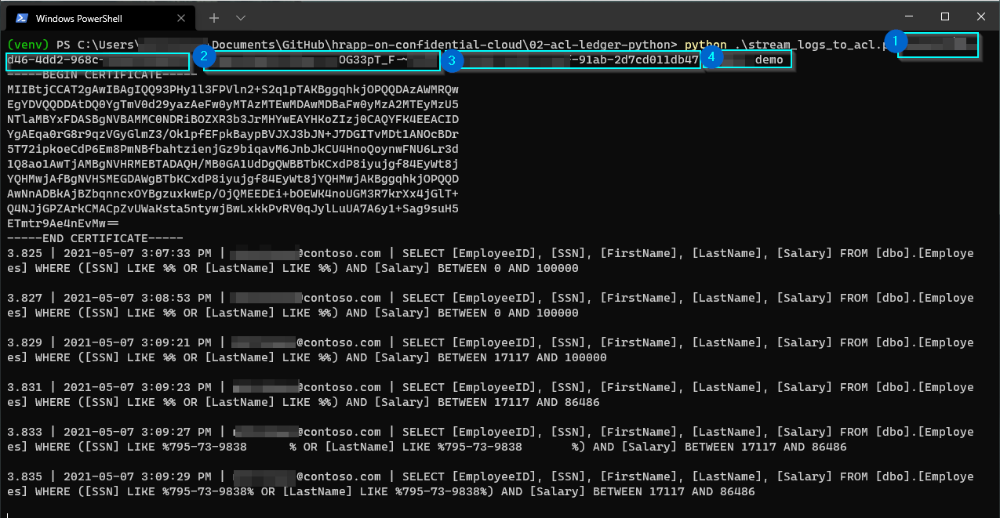

# End-to-end Sensitive Web App - with Azure Confidential Services

_An end-to-end demonstration of a Confidential Web App running on an AMD powered Confidential VM with Azure SQL, AKV mHSM and Azure Confidential Ledger._

## Overview

This repository demonstrates an architectural design pattern for hosting an end-to-end **Confidential Application** on Azure Confidential Compute:<br>



### Core components

- **Sensitive Data** - [**Azure SQL DB - Always Encrypted with secure enclaves**](https://docs.microsoft.com/en-us/azure/azure-sql/database/always-encrypted-with-secure-enclaves-landing): For hosting a sample confidential `ContosoHR` Database - with `SSN` and `Salary` Columns that are encrypted via `CMK`.
- **Sensitive Data Encryption Keys** - [**Azure Key Vault - mHSM**](https://docs.microsoft.com/en-us/azure/key-vault/managed-hsm/overview): A FIPS 140-2 Level 3 validated HSM - used in this case for storing the [Always Encrypted Column Master Key](https://docs.microsoft.com/en-us/sql/relational-databases/security/encryption/create-and-store-column-master-keys-always-encrypted?view=sql-server-ver15) - or `CMK` for `ContosoHR` Database.
- **Sensitive Application Logic** - [**Azure Confidnetial VM - with AMD EPYC 3 Sev-SNP Private Preview Signup**](https://aka.ms/cvmsignup): For hosting an ASP.NET Web app that queries `ContosoHR` Azure SQL DB using the [ADO.NET driver](https://docs.microsoft.com/en-us/sql/connect/ado-net/microsoft-ado-net-sql-server?view=azuresqldb-current), as well as a Python Application that leverages the Azure Confidential Ledger [PyPi Python package](https://pypi.org/azure-confidentialledger) to persist Sensitive Logs generated on the Web app (in this case, query history).
- **Sensitive Application logs** - [**Azure Confidential Ledger**](https://docs.microsoft.com/azure/confidential-ledger/) [(Private Preview Signup)](https://aka.ms/ACLPreview): As an append-only, immutable ledger (see [CCF](https://microsoft.github.io/CCF/main/overview/concepts.html#ledger) documentation) for hosting Sensitive Logs.

All components of this architecture, including **Sensitive Data**, **Sensitive Data Encryption Keys**, **Sensitive Application Logic** and **Sensitive Application logs** - are hosted at or above the blue dotted line highlighted below: <br>


💡 **Note**: Azure also offers [Intel-SGX enabled Virtual Machines](https://docs.microsoft.com/en-us/azure/confidential-computing/confidential-computing-enclaves#intel-sgx-enabled-virtual-machines) that can be used to host our Sensitive Application Logic.

In this demonstration, we leverage a **Confidential VM** to emphasize one core point - no code changes are required of an existing application (in our case, an ASP.NET Web App) to run on an AMD Sev-SNP enabled Virtual Machine on Azure.

### Live Demo

[](https://youtu.be/d2w0r-geduM)

---

# Setup

## Pre-requisites

1. **Azure Confidential VM - `Standard_DC2as_v4`**: At the time of writing, Azure CVMs are in Limited Preview and can be enabled for your subscription by filling out this form [here](https://aka.ms/cvmsignup).

   💡 For the purposes of following along, since CVM's provide a seamless deployment experience for the Web App, you can also leverage any Windows Machine available to you.

   On this machine, install the following pre-requisite components:

   - [Visual Studio Code](https://code.visualstudio.com/) and/or [Visual Studio Pro](https://visualstudio.microsoft.com/vs/professional/)
   - [Python](https://www.python.org/downloads/release/python-385/)

2. **Azure Confidential Ledger**: For detailed deployment steps on ACL - please refer to the documentation [here](https://docs.microsoft.com/azure/confidential-ledger/). The Python package for ACL can be found [here on PyPi](https://pypi.org/azure-confidentialledger).

3. **Azure SQL DB deployment for `ContosoHR`** - To quickly deploy an **Azure SQL Database**, **Azure Key Vault** and **Microsot Azure Attestation** while going through the steps in setting up `ContosoHR` Database, please refer to [this article](https://docs.microsoft.com/en-us/azure/azure-sql/database/always-encrypted-enclaves-getting-started).

---

## Setup

We break down our setup into **3** components from the demo:


### 1. Web App

1. Download the code from this repo into an Azure Confidential VM with the pre-requisite components installed.

   Validate python version by using:

   ```powershell
   python --version
   ```

   

2. To launch the Web app, we first inject the secrets required in [appsettings.json](01-contoso-web-app-asp-net/ContosoHR/appsettings.json):

   ```powershell

   # Replace .. with your Directory location
   cd "..\hrapp-on-confidential-cloud\01-contoso-web-app-asp-net\ContosoHR"

    # Replace with your SQL Server connection settings
   dotnet user-secrets set "ConnectionStrings:ContosoHRDatabase" "Data Source = your--azure--sqlserver.database.windows.net; Initial Catalog = ContosoHR; Column Encryption Setting = Enabled;Attestation Protocol = AAS; Enclave Attestation Url = https://your--attestation--url.eus.attest.azure.net/attest/SgxEnclave; User Id = your--sql--username; Password = your--sql--password"

   # Replace with a Service Principal's Credential that can read the CMK from AKV
   dotnet user-secrets set "KeyVault:clientId" "your--client--id"
   dotnet user-secrets set "KeyVault:secret" "your--client--secret"
   ```

   

3. The Web App is expecting to store Sensitive logs from the demo in `D:\ContosoHR_logs`. Create this folder.

   > 💡 If you don't have a `D:\` drive, please use `C:\`, and update [line 103](01-contoso-web-app-asp-net/ContosoHR/Controllers/EmployeeController.cs).

4. You can launch the Web App using IIS Express now and successfully connect to Azure SQL:
   

   Any sensitive queries performed will be streaming to `querylogs.txt`:
   

### 2. Console App: Stream to ACL using Python

5. We start a new Python Virtual Environment via:

   ```powershell
   # Replace .. with your Directory location
   cd "..\hrapp-on-confidential-cloud\02-acl-ledger-python"

   # Create venv
   python -m venv venv

   # Activate venv
   ..\hrapp-on-confidential-cloud\02-acl-ledger-python\venv\Scripts\Activate.ps1

   # Install pypi dependencies
   pip install -r requirements.txt

   # Install ACL wheel (Once available on pypi, please use pip install azure-confidentialledger instead of the .whl below)
   pip install azure_confidentialledger-1.0.0b1-py2.py3-none-any.whl
   ```

   And if you had changed the log location to `C:\` drive, then change it within [line 13](02-acl-ledger-python/stream_logs_to_acl.py) as well.

6. Start the Python ACL Streaming Process:

   ```powershell
   # python .\stream_logs_to_acl.py clientId clientSecret tenantId ledgerID
    python .\stream_logs_to_acl.py your--clientID your--clientSecret your--tenantId your--unique--ledger
   ```

   

### 3. SQL Extended sessions

7. Query the table using `SELECT * FROM [dbo].[Employees]`

8. To create a new Extended events session, run [02-enable-XESession-AzSQLDB.sql](03-azure-sql-ae-scripts/02-enable-XESession-AzSQLDB.sql)

9. To intercept queries from the session, run [03-query-XEvents.sql](03-azure-sql-ae-scripts/03-query-XEvents.sql)
